# E-Commerce Simulation

A demo e-commerce platform built with Next.js and Supabase.  
It simulates a storefront for customers and a CMS for administrators.

## 🚀 Tech Stack

- **Frontend:** Next.js (with TypeScript)
  - Styled with CSS Modules
- **Database & Auth:** Supabase
- **Emails:** Resend (purchase confirmation emails)

## ✨ Features

### Customer Storefront

- Browse products with search and filters (category, subcategory, brand, price).
- Add products to cart and adjust quantities.
- Checkout with a simple form (name, email, shipping address).
- Fake purchase flow: sends a confirmation email and displays confirmation page.

### CMS (Admin)

- Restricted login: only admin accounts (set in Supabase) can access.
- Manage products: add, edit, delete.
- View all orders placed by customers.
- Manage taxonomies: categories, subcategories, brands.
- Select featured products to highlight on the homepage.

## 📸 Screenshots

### Client – Products View

Product list with filters sidebar and search.  
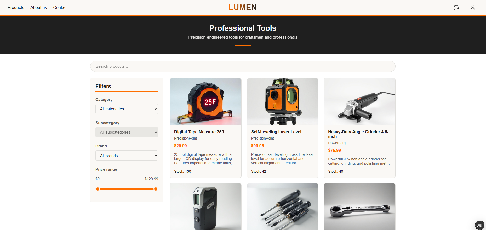

### Client – Cart

Cart dropdown with selected items.  
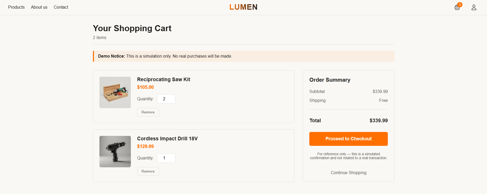

### Client – Checkout

Checkout form with name, email, and address.  
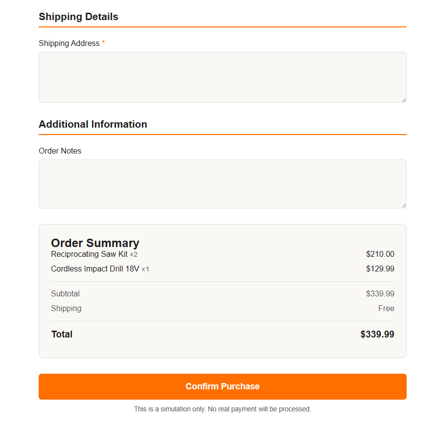

### Client – Confirmation

Order confirmation screen after purchase.  
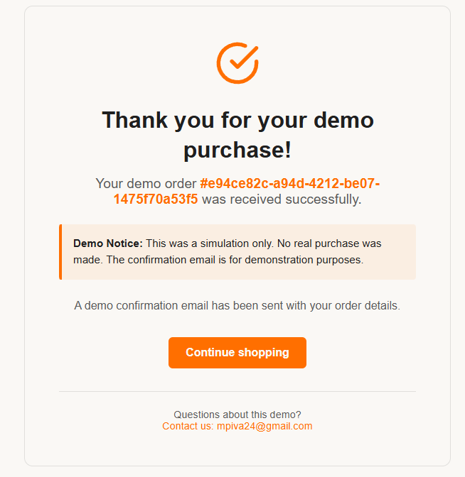

### Client – Confirmation Email

Example of the confirmation email sent via Resend.  
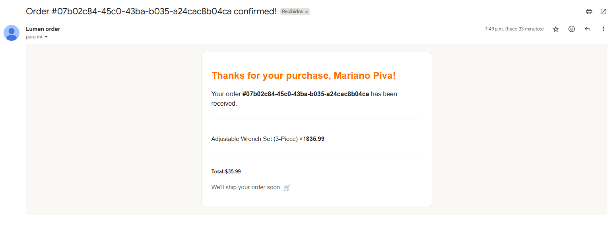

### CMS – Dashboard

Main admin dashboard with navigation to all sections.  
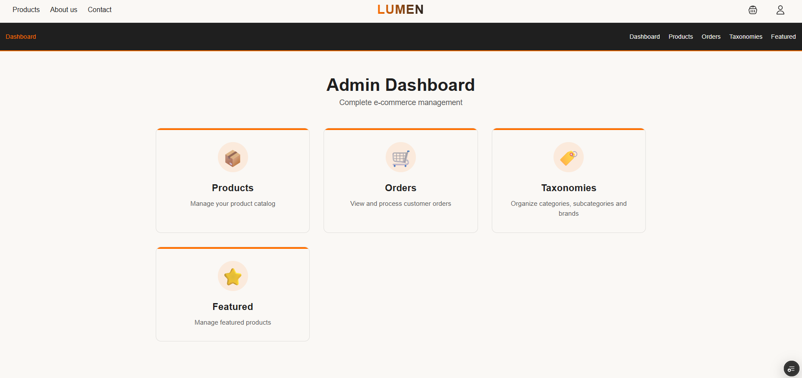

### CMS – Products

Admin view of all products with options to edit, delete, or add.  
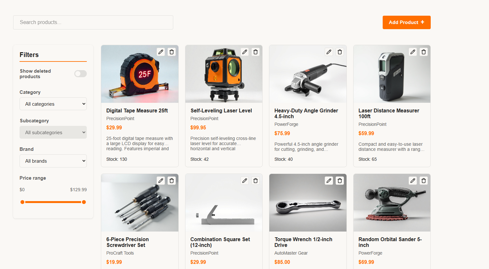

### CMS – Add Product

Form for creating a new product.  
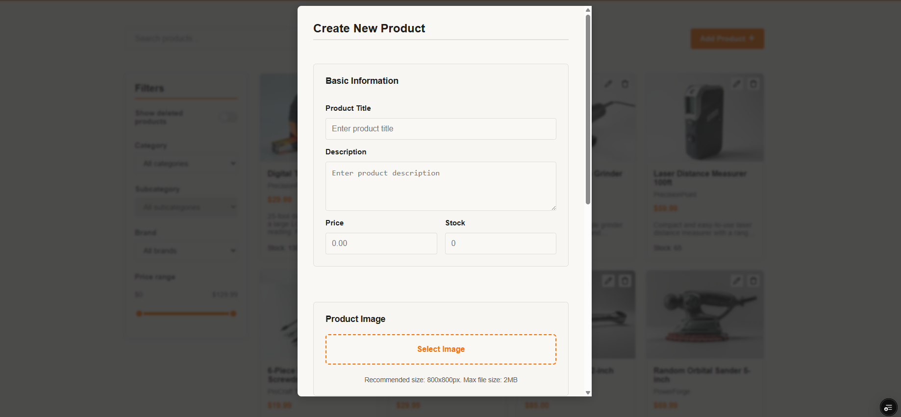

### CMS – Orders

List of all customer orders.  
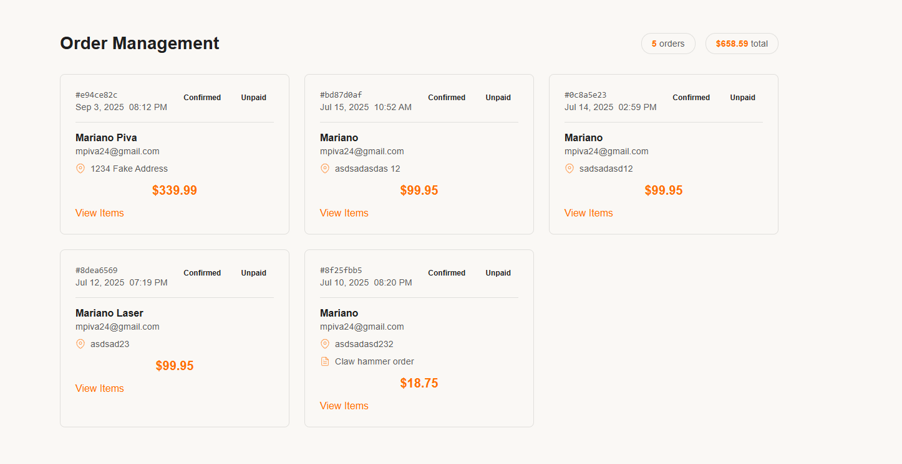

### CMS – Taxonomies

Manage categories, subcategories, and brands.  
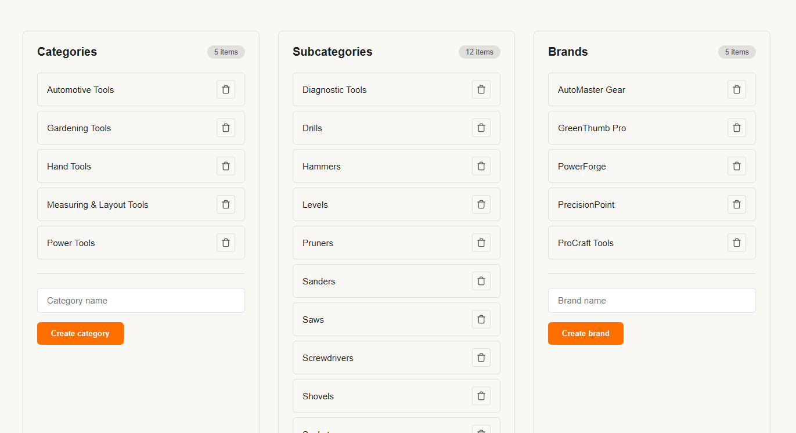

### CMS – Featured

Select products to be featured on the homepage.  
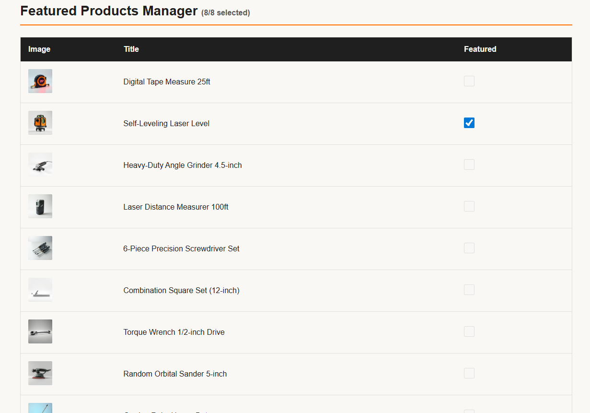

## ⚙️ Environment Variables

Create a `.env.local` file with the following keys:

```bash
NEXT_PUBLIC_SUPABASE_URL=...
NEXT_PUBLIC_SUPABASE_ANON_KEY=...
RESEND_API_KEY=...
```

## 🛠️ Getting Started

Clone the repository and install dependencies:

```bash
git clone https://github.com/yourusername/ecommerce-simulation
cd ecommerce-simulation
pnpm install
pnpm dev
```

Then open <http://localhost:3000>
